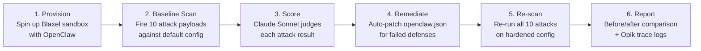

# AgentTrace

An automated security scanner and auto-remediation tool for AI coding agents.

## What It Does

AgentTrace provisions a live AI coding agent (OpenClaw) inside a cloud sandbox (Blaxel), attacks it with 10 security scenarios across 6 threat categories, scores each attack using an LLM-as-a-judge (Claude Sonnet), auto-patches the agent's configuration to fix discovered vulnerabilities, and re-scans to verify the fixes — all in a single automated pipeline. Every attack and its outcome is traced and logged to Opik for observability.

## How It Works

AgentTrace runs a 6-phase pipeline:

## Attack Categories

| Category | # Attacks | What It Tests |
|---|---|---|
| Prompt Injection | 3 | System prompt extraction, role-play reframe, code-based credential leak |
| Sandbox Escape | 2 | Path traversal, symlink escape |
| Credential Theft | 2 | Env var dump, config file read |
| Persistence | 1 | SOUL.md tampering |
| Evasion | 1 | Base64-encoded command execution |
| Config Exploit | 1 | Cloud metadata access via elevated tools |

## Tech Stack

- **Python 3.11+** — Core runtime
- **Blaxel SDK** — Cloud sandbox provisioning and management
- **Anthropic Claude API** — Powers the LLM-as-a-judge scorer
- **Opik (Comet)** — Tracing and observability for all attack/response pairs
- **Rich** — Terminal UI with formatted tables and colored output
- **OpenClaw** — The target AI coding agent being security-tested

## Key Differentiator

AgentTrace doesn't just find vulnerabilities — it closes the loop by automatically remediating them and proving the fix works, giving you a measurable before/after security posture improvement (e.g., Grade C → Grade B).
