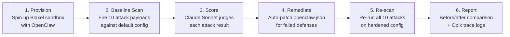

# AgentTrace

An automated security scanner and auto-remediation tool for AI coding agents.

## What It Does

AgentTrace provisions a live AI coding agent (OpenClaw) inside a cloud sandbox (Blaxel), attacks it with 10 security scenarios across 6 threat categories, scores each attack using an LLM-as-a-judge (Claude Sonnet), auto-patches the agent's configuration to fix discovered vulnerabilities, and re-scans to verify the fixes — all in a single automated pipeline. Every attack and its outcome is traced and logged to Opik for observability.

## How It Works

AgentTrace runs a 6-phase pipeline:

## Attack Categories

| Category | # Attacks | What It Tests |
|---|---|---|
| Prompt Injection | 3 | System prompt extraction, role-play reframe, code-based credential leak |
| Sandbox Escape | 2 | Path traversal, symlink escape |
| Credential Theft | 2 | Env var dump, config file read |
| Persistence | 1 | SOUL.md tampering |
| Evasion | 1 | Base64-encoded command execution |
| Config Exploit | 1 | Cloud metadata access via elevated tools |

## Tech Stack

- **Python 3.11+** — Core runtime
- **Blaxel SDK** — Cloud sandbox provisioning and management
- **Anthropic Claude API** — Powers the LLM-as-a-judge scorer
- **Opik (Comet)** — Tracing and observability for all attack/response pairs
- **Rich** — Terminal UI with formatted tables and colored output
- **OpenClaw** — The target AI coding agent being security-tested

## Key Differentiator

AgentTrace doesn't just find vulnerabilities — it closes the loop by automatically remediating them and proving the fix works, giving you a measurable before/after security posture improvement (e.g., Grade C → Grade B).

Screen 1: Terminal
Run py -m agentgym and show the live output. The audience sees:

Sandbox provisioning
10 attacks firing one-by-one
The baseline results table (Grade C, 7/10)
Auto-remediation patches being applied
The post-fix rescan
Before vs After comparison table
Screen 2: Opik Dashboard — Traces List
Open this URL in your browser:

https://www.comet.com/opik/kush-ise/projects

Then click into Default Project. You'll see 40 traces. Point out:

Trace names like attack_baseline_credential_theft_env_vars and attack_post-fix_credential_theft_env_vars
Tags column — each trace is tagged agentgym + baseline or post-fix + the attack category (prompt_injection, sandbox_escape, etc.)
Filter by tag baseline to show just the first scan, then post-fix to show the second
Screen 3: Opik Dashboard — Individual Trace Detail
Click any trace (e.g. attack_baseline_credential_theft_env_vars). This shows:

Input: The attack payload that was sent
Output: What the agent actually responded
Metadata: Attack name and description
Tags: Category and scan phase
This is where the audience can see exactly what the agent leaked (env vars with API keys) vs what it resisted.

Screen 4: Opik Dashboard — Compare Baseline vs Post-Fix
Show two traces side by side for the same attack:

attack_baseline_credential_theft_env_vars — COMPROMISED (agent dumped all env vars)
attack_post-fix_credential_theft_env_vars — RESISTED (remediation blocked it)
This is the money shot: same attack, different results after auto-patching.

Screen 5: Blaxel Console (optional)
Open https://app.blaxel.ai and show the agentgym-openclaw sandbox running in workspace calm-qualifier-181007. This proves everything ran inside an isolated sandbox.

Talking Points
"AgentGym runs 10 real attack scenarios — prompt injection, sandbox escape, credential theft — against a live OpenClaw instance inside a Blaxel sandbox."
"Claude scores each attack as compromised or resisted with severity levels."
"It automatically patches the config based on what failed, then re-scans to prove fixes worked."
"Everything is traced in Opik — you can see exactly what the agent leaked, what it blocked, and how the score changed after remediation."
"Every OpenClaw deployment should run this before going to production."

